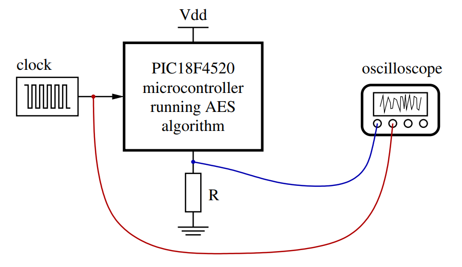

# Correlation Power Analysis Attack

## Hardware Security Project

### Master of Cybersecurity

The goal of the project is to implement a correlation power analysis (CPA) attack to the 128-bit AES encryption algorithm and retrieve the 16 bytes of the key.

The students will be provided with a set of power consumption traces acquired when a microcontroller (PIC18F4520) is running the AES encryption algorithm over several plaintexts. The current is probed via the voltage drop across a series connected resistor as indicated in Figure 1.



_Figure 1: Diagram of the experimental setup to acquire the power consumption traces_

## Overview

````
├── LICENSE
├── README.md
├── assets
│   └── image.png
├── attack1.ipynb
├── data
│   └── dataset1
│       ├── cleartext.txt
│       ├── trace0.txt
│       ├── trace1.txt
│       ├── trace2.txt
│       ├── trace3.txt
│       ├── trace4.txt
│       ├── trace5.txt
│       ├── trace6.txt
│       ├── trace7.txt
│       ├── trace8.txt
│       ├── trace9.txt
│       ├── trace10.txt
│       ├── trace11.txt
│       ├── trace12.txt
│       ├── trace13.txt
│       ├── trace14.txt
│       └── trace15.txt
└── requirements.txt
````

## Instructions

1. Clone the repository

```bash
git clone https://github.com/blueh0rse/cpa-attack
```

2. Create a virtual environment

```bash
python3 -m venv .venv
```

3. Activate the virtual environment

```bash
source .venv/bin/activate
```

4. Install the dependencies

```bash
(.venv)$ pip install -r requirements.txt
```

5. Run the notebook `attack1.ipynb`
